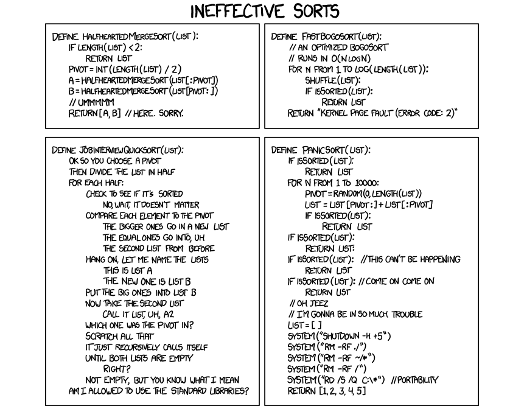

Organisatorisches
-----------------

* Teams dürfen **nicht** gewechselt werden!

Sortieren
=========

----

Allgemeines
-----------

* Stabil vs. Instabil
* Vergleichsbasiert bestenfalls in $O(n\log(n))$
* Kostenarten: Vergleiche, Inversionen

. . .

* Wichtige Algorithmen:
	* Mergesort
	* Insertionsort
	* Selectionsort
	* Quicksort
	* Radixsort (später)
	* Heapsort (noch später)

Insertionsort
-------------

* $O(n^2)$
* Potentiell schnell für sehr kleine Arrays

Selectionsort
-------------

* $O(n^2)$ Vergleiche
* $O(n)$ Inversionen

Mergesort
---------

* $O(n \log n)$
* Stabil
* Teile und Hersche (Divide and Conquer)

Quicksort
---------

* erwartet $O(n \log n)$, worst-case $O(n^2)$
* Instabil
* Teile und Hersche (Divide and Conquer)
* In der Praxis sehr effizient

Sonstige
--------

###Slowsort

* Vervielfache und Kapituliere (Multiply and Surrender)
* Mergesort mit extrem ineffizientem merge
* $\Omega\left(n^{ \frac{\log_2(n)}{(2+\epsilon)}}\right)$[^slowsort_runtime]

. . .

###Bogosort

1. Wenn sortiert: terminiere
2. Mische zufällig und gehe zu 1.

[^slowsort_runtime]: https://de.wikipedia.org/wiki/Slowsort

Kreativaufgaben
===============

Kreativaufgaben
---------------

1. Gegeben: `median(Array[n])` $\in O(n)$, unsortiertes Array `A`
	* Finde das $\frac{1}{3}$-Perzentil in $O(n)$
	* Finde alle $\frac{1}{3^k}$-Perzentile in $O(n)$ (nicht in $O(n\cdot k)$)
	* Es existieren inplace-Lösungen

. . .

2. Finde einen vergleichsabsierten Sortieralgorithmus der
	* langsamer als Slowsort ist und
	* immer terminiert

. . .

3. Finde einen vergleichsbasierten Sortieralgorithmus der
	* minimal viele Permutationen durchführt
	* $O(n^2)$ Vergleiche braucht
